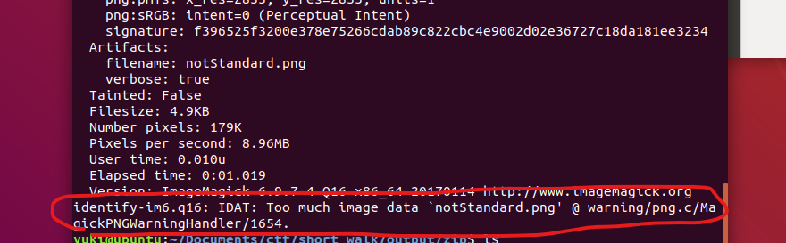
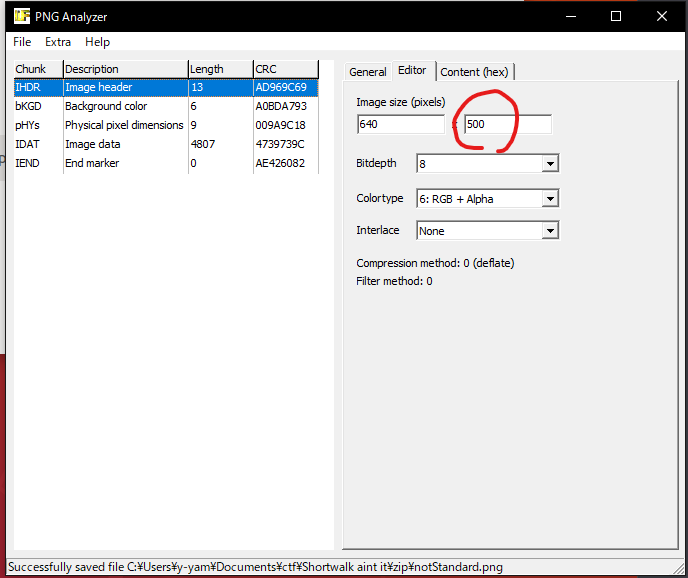
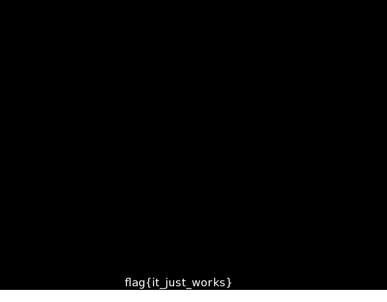

# Team 17 Solutions for C2C CTF Finals

Link to the original CTF can be found here: <http://ctf.cs.technion.ac.il/>

These are writeups to problems that my team members and I were able to solve in the C2C CTF finals. We ended up placing 3rd in the entire competition, narrowly trailing 1st and 2nd place who got the same number of solves as us but did so in a faster time period. This competition has definitely taught me a lot about working in a team and also learning to perservere through hard problems. I'm excited with how well we did this year and I'm very much looking forward to being a part of C2C CTF again next year, where MIT will be the hosting university!

# What a Mess

Category: Crypto
Points: 500

Prompt: Unravel this sweet mess

~~~text
<--------------GE2Q====----00110001 00110100-----<--------------GE2Q====----00110001 00110100-----<0a<-----GE2Q====--------------------<-----GE2Q====--------------------<0a<--------00110001 00110100-31 32----00110001 00110100----00110001 00110100--<--------00110001 00110100-31 32----00110001 00110100----00110001 00110100--<0a<--31 32-----------------------<--31 32-----------------------<0a<---------------------------<---------------------------<0a<---------------------------<---------------------------<0a<--------------GE2Q====----00110001 00110100-----<--------------GE2Q====----00110001 00110100-----<0a<-----GE2Q====--------------------<-----GE2Q====--------------------<0a<--------00110001 00110100-31 32----00110001 00110100----00110001 00110100--<--------00110001 00110100-31 32----00110001 00110100----00110001 00110100--<0a<--00110001 00110100-----------------------<--00110001 00110100-----------------------<0a<---------------------------<---------------------------<0a<---------------------------<---------------------------<0a<--------------GE2Q====----00110001 00110100-----<--------------GE2Q====----00110001 00110100-----<0a<-----GE2Q====--------------------<-----GE2Q====--------------------<0a<--31 32----00110001 00110100-31 32----00110001 00110100----00110001 00110100--<--31 32----00110001 00110100-31 32----00110001 00110100----00110001 00110100--<0a<---------------------------<---------------------------<0a<---------------------------<---------------------------<0a<---------------------------<---------------------------<0a<--------------GE2Q====----00110001 00110100-----<--------------GE2Q====----00110001 00110100-----<0a<-----GE2Q====--------------------<-----GE2Q====--------------------<0a<--------00110001 00110100-31 32----00110001 00110100----00110001 00110100--<--------00110001 00110100-31 32----00110001 00110100----00110001 00110100--<0a<--31 32-----------------------<--31 32-----------------------<0a<---------------------------<---------------------------<0a<---------------------------<---------------------------<
~~~

The flag will be in the format flag{What a nice clean flag}

Solution: At first glance, it seems the ciphertext is made of multiple parts that are encrypted differently.

`<---------------------------<---------------------------<0a`

`GE2Q====`

`00110001 00110100`

`31 32`

The binary decodes to '14', while GE2Q==== is base32 and decodes to 15. 31 32 decodes to 12 in hex. Putting it all together, we get something like this:

~~~text
<--------------15----14-----<--------------15----14-----<
<-----15--------------------<-----15--------------------<
<--------14-12----14----14--<--------14-12----14----14--<
<--12-----------------------<--12-----------------------<
<---------------------------<---------------------------<
<---------------------------<---------------------------<

<--------------15----14-----<--------------15----14-----<
<-----15--------------------<-----15--------------------<
<--------14-12----14----14--<--------14-12----14----14--<
<--14-----------------------<--14-----------------------<
<---------------------------<---------------------------<
<---------------------------<---------------------------<

<--------------15----14-----<--------------15----14-----<
<-----15--------------------<-----15--------------------<
<--12----14-12----14----14--<--12----14-12----14----14--<
<---------------------------<---------------------------<
<---------------------------<---------------------------<
<---------------------------<---------------------------<

<--------------15----14-----<--------------15----14-----<
<-----15--------------------<-----15--------------------<
<--------14-12----14----14--<--------14-12----14----14--<
<--12-----------------------<--12-----------------------<
<---------------------------<---------------------------<
<---------------------------<---------------------------<
~~~

Once we got to this point, our team were stuck for a long time trying to figure out how the ciphertext could further be decoded. We considered ideas like esoteric languages like BF or breaking the quadrants apart and looking for symmetry. At the end one of our team member with a background in music recognized this as a song tablature for guitar which plays the tune of the song "Sweet Child of Mine".

Flag: flag{sweet child o mine}

## Message from the past 

Category: Crypto
Points: 350

Prompt: There is an important message here

~~~text
4qCo4qCo4qCo4qCo4qCo4qCA4qCo4qCo4qCo4qCo4qCkCuKgpOKgqOKgqOKgqOKgqOKggOKgpOKgpOKgpOKgqOKgqArioKTioKjioKjioKjioKjioIDioKTioKTioKTioKTioKgK4qCk4qCk4qCo4qCo4qCo4qCA4qCo4qCo4qCo4qCk4qCkCuKgqOKgqOKgpOKgpOKgpOKggOKgpOKgpOKgpOKgpOKgpArioKTioKjioKjioKjioKjioIDioKTioKTioKTioKTioKgK4qCk4qCk4qCo4qCo4qCo4qCA4qCo4qCo4qCo4qCk4qCkCuKgqOKgqOKgpOKgpOKgpOKggOKgpOKgpOKgpOKgpOKgpArioKTioKTioKjioKjioKjioIDioKjioKjioKjioKjioKQK4qCk4qCo4qCo4qCo4qCo4qCA4qCk4qCk4qCk4qCo4qCoCuKgpOKgqOKgqOKgqOKgqOKggOKgqOKgqOKgqOKgqOKgqArioKjioKjioKTioKTioKTioIDioKTioKTioKTioKTioKQK4qCo4qCo4qCo4qCo4qCo4qCA4qCk4qCk4qCo4qCo4qCoCuKgpOKgqOKgqOKgqOKgqOKggOKgqOKgpOKgpOKgpOKgpArioKTioKTioKjioKjioKjioIDioKTioKTioKTioKTioKg=
~~~

Flag will be in the format FLAG{You found a Flag}

Solution: This prompt is similar to the last problem. The equals sign at the end of the string indicates to us this is some kind of base32 or base64 encoding. Using CyberChef we were able to figure the message can be decoded using the following translation steps:

Ciphertext -> Base64 -> Braille -> More Code -> Hex

Flag: flag{This is the Way}

## 9 Lives

Category: Crypto
Points: 350 

~~~text
Can you crack this hash?

88ad4a0b84b7af2234d1c3169562b0d0

Flag will be in the format FLAG{password}
~~~

Solution: The hint provided tell us that the password was resetted this year. Thus we can assume that the number "21" or "2021" or "twenty" and "one" will be in there somewhere in the password.With the problem titled "9 Lives", we can infer that it wants us to use hashcat.

I was able to crack the using the following command with the `rockyou.txt` password list:

`hashcat -a 1 -m 0 ex.hash rockyou.txt hint.txt`

Note: The hint.txt contains the hints I mentioned earlier.

The password came out to be "rachmaninoff2021"

Flag: flag{rachmaninoff2021}

## Very Secure Protocol

Category: Crypto
Points: 600

Prompt: We have detected a C2 payload on one of our servers! The Networks team have extracted its communications from their traffic logs, and Operations have dumped the payload code from the running process before killing it. Find out what the actors have exfiltrated!

Solution: We are given a Python file with code used by one side to encrypt their message, and the output is provided in the logs.json file. After a bit of deciphering and research on the Python variable names we were able to tell that they are performing a Diffie-Hellman key exchange and then using the key generated as their AES encryption key. They then encrypt their message/flag using AES.

Taking a look at the JSON file we can see some of the variable values encoded in Base64. Specifically we are given `p`, `q` , `A` , and `B`

The shared AES key is generated by doing `A^b mod p` and then SHA256 hashing the result. In  Here `b` is a number which we do not know (except for the fact that it is less than `p`).

We are also given `B`, which is calculated by doing `g^b mod p`.

In that case, the target for this problem is that we want to find `b` so we can recover the shared key. From looking around online I see that there is a discrete logarithm calculator that can help us do this quickly, e.g., finding the exponent in `x^y mod n` when x and n is known (and when they aren't too large). By putting that in we see that `b` is equal to 620620105.

After that I plugged in the value for b and used the provided function in the file to decrypt both `ret` messages. All this code was inserted in the original encryption file at [payload.py](Very_Secure_Protocol/payload.py)

~~~py
p = base64_to_long(j['inc'][0]['p'])
g = base64_to_long(j['inc'][0]['g'])
A = base64_to_long(j['inc'][0]['A'])
print(p,g,A)
B = base64_to_long("Ph6IeA==")
print("B",B)
b = 620620105
print(pow(g,b,p))

shared = pow(A, b, p)
shared = sha256(long_to_bytes(shared)).digest()
cipher = AES.new(shared, AES.MODE_ECB)
print(decrypt(cipher, j['out'][1]['return']))
print(decrypt(cipher, j['out'][2]['return']))
~~~~

Output: 
~~~py
2272978429 2 1116819144
B 1042188408
1042188408
b'sensitive.txt\n'
b'FLAG{wh4dy4_m3an_32_b1t5_1s_1n53cur3}\n
~~~

Flag: flag{{wh4dy4_m3an_32_b1t5_1s_1n53cur3}

## Welcome to my crib

Category: Crypto
Points: 600

Prompt: We have intercepted encrypted communications between actors. From previous behaviour analysis, we found that all messages were encrypted using a repeating shared 16 byte XOR key, and the first two messages were testing whether the channel is stable, and consisted of common lowercase English words separated by a space. We may know at least some of the ciphertext. Figure out how to recover the last message, which consists of only the flag.

File: [enc](Welcome_to_my_Crib/xor_encrypted_messages.txt)

Solution: From what the problem tells us the first two lines encrypt all lowercase words separated by spaces, while the third line encrypts the flag. We know that XOR encryption is reversible by taking the ciphertext ^ key to get the plaintext.

Initially I jumped on a script that I created for the CryptoPals Set 1 Challenge 6 problem which deals with this same problem. It attempts to iterative "guess" the nth character of key by pulling all the nth characters from the ciphertext, XOR-ing it with the guess key and check if they result in a printable ASCII character. The character which results in the most printable character is chosen for the key. However, my code ended up giving a lot of gibberish results.

After an hour of trying with custom code I landed on this website: <https://www.dcode.fr/xor-cipher>

I found that putting down the second line of the ciphertext and asking the tool to guess the key yielded in an exact decryption (no weird characters hanging about). This is the key in hex format: `12810f09b219ad5f1053147f20a29d`

I then used the key and XOR-ed with the third line to get back the flag.

flag: flag{x0r_a1nt_g00d_en0ugh}

## Shortwalk aint it

Category: Stego
Points: 50

Even though it was only a 50 points question, this stego problem gave us a lot of trouble since we weren't able to decipher what exactly was being hidden in the image. Some of our initial attempts including running pngcheck (which found some corruption) -> using PCRT to fix corrupted chunks and using stegonline to examine the image.

File: [stego.png](Shortwalk_Aint_It/stego.png)

After some work, we figured out that there was a zip file hidden in the image which can be extracted through binwalk, and when you run `unzip 5400A.zip` it prints out the Morse code and prompts for a password. We can guess that the folder simply wants us to decode the message and return it as the password, e.g. "flag(moorseisstillcool)". 

The first few bytes of the notes.txt file contains the flag.

Flag: flag{less_walking_more_lerking}

## b"00000001"

Category: Stego
Points: 150

Prompt: The sound file has strange distorations when trying to listen to it. How suspicious. Uses file from Shortwalk aint it

Solution: If we take a look at the hexdump of the [notes.txt](Shortwalk_Aint_It/_stego.png.extracted/notes.txt) we can see that after the cleartext flag there is actually a .wav file. Deleting the flag from the file allows us to open up the music file. Based on the problem's name we can assume it has do to something with hiding information in the Least Significant Bit (LSB) of the file. I tried a tool called WavSteg to extract information using this method but it only showed garbage output. After a bit research I found a tutorial with a Python script to do this: <https://medium.com/analytics-vidhya/get-secret-message-from-audio-file-8769421205c3>

Altogether the script looks like this: 

~~~py
#!/usr/bin/python
import wave, os, struct

wav= wave.open("notes.wav", mode='rb')
print (wav.getparams())

frame_bytes = bytearray(list(wav.readframes(wav.getnframes())))
shorts = struct.unpack('H'*(len(frame_bytes)//2), frame_bytes)
    
# Get all LSB's
extractedLSB = ""
for i in range(0, len(shorts)):
        extractedLSB += str(shorts[i] & 1 )# divide strings into blocks of eight binary strings
# convert them and join them back to string
string_blocks = (extractedLSB[i:i+8] for i in range(0, len(extractedLSB), 8))
decoded = ''.join(chr(int(char, 2)) for char in string_blocks)
print(decoded[:200].encode('utf-8'))

wav.close()
~~~

The flag can be found at the beginning of the output

Flag: flag{golF_grueL_teA_muG}

## Tall Orders

Category: Stego
Points: 300

Prompt: We've tried every known steganography tool at this file but we can't find any hidden data. We know there is something more to this image than what we can see. Uses file from Shortwalk aint it

Solution: After extracting the data from the original `stego.png`, we get an image named `notStandard.png`. Running the `identify` command on it from ImageMagick yields the following result:

`identify -verbose notStandard.png`

We can see there is extra data embedded in an IDAT chunk. In that case, we can try to extend the height of the png to show the hidden data, which can be done by modifying the IHDR section.

Opening up the file in a tool called [PNG_Analyzer.exe](Tall_Orders/PNG_Analyzer.exe), we can increase the image height to be 500 pixels. Original tool link: https://github.com/albusshin/hacker.org/blob/master/PNG_Analyzer.exe

Opening up the image we see the flag is at the bottom.

Flag: flag{it_just_works}

## Hear Words See Sound

Category: Stego
Points: 250

Prompt: A report recently came in from an allied intelligence source about the exfiltration method detected has often been paired with a visual exfiltration method. Find the information that is encoded visually. Uses File from Shortwalk aint it

Solution: Using the `notes.wav` file we got from the original `stego.png`, we can inspect it in Audacity and turn on the Spectogram view to be able to 'see' the audio file. This is done by clicking on the Channel name and choosing the "spectogram" option.

Flag: flag{i_can_see_sound}

## Y2

Category: Scripting
Points: 50 

Prompt: What is the value of y2?

~~~sql
with
    t1(x1, x2) as (select 1, 2),
    t2(y1, y2) as (
      select x1 * 2, x2 * 2
      from t1
    )
  select *
  from t1, t2
~~~

Flag will be in the format FLAG{#}

Solution: This is basic SQL syntax. We can see t2 simply multiples the values of t1 by 2, so y2 will be 4.

Flag: flag{4}
